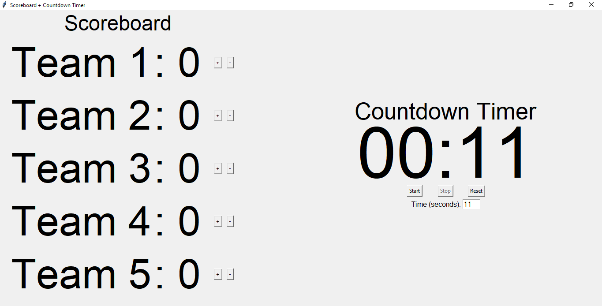
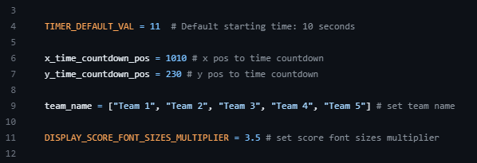
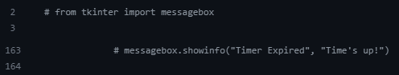

# Scoreboard and Countdown Timer GUI using Tkinter

## How to use:

### •To run the Scoreboard and Countdown Timer GUI, install `tkinder` module:

```bash
pip install tk
```
### •Download and run the program:

```bash
python scoreboard+timer_countdown.py
```

### •The Scoreboard and Countdown Timer GUI will be started:



## Editing tools:



### •Change default Timer value:

```python title="editt.py"
TIMER_DEFAULT_VAL = 11  # Default starting time: 10 seconds
```

### •Change default Countdown pos:

```python title="editt.py"
x_time_countdown_pos = 1010 # x pos to time countdown
y_time_countdown_pos = 230 # y pos to time countdown
```

### •Change default Team name:

```python title="editt.py"
team_name = ["Team 1", "Team 2", "Team 3", "Team 4", "Team 5"] # set team name
```

### •Change default Font sizes:

```python title="editt.py"
DISPLAY_SCORE_FONT_SIZES_MULTIPLIER = 3.5 # set score font sizes multiplier
```

### •Display Popup message when time's up:

```python title="editt.py"
Uncomment this code
```


